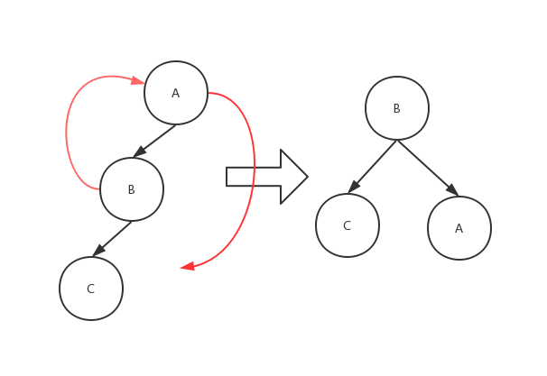
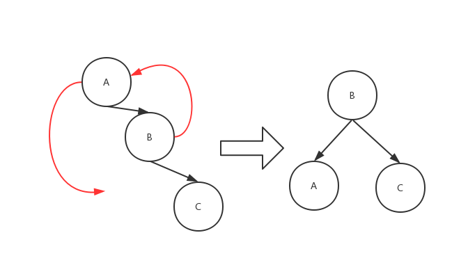
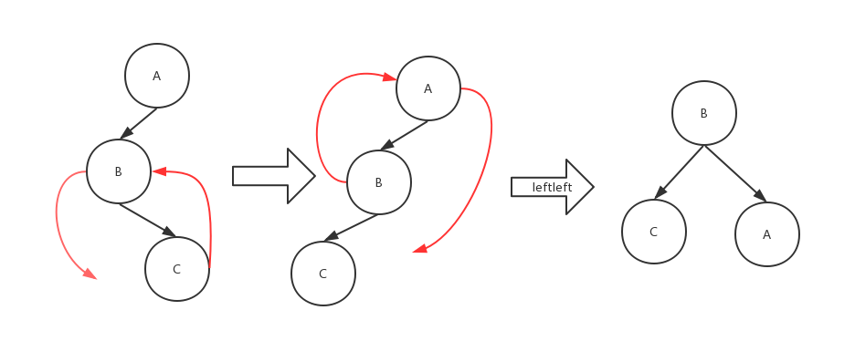
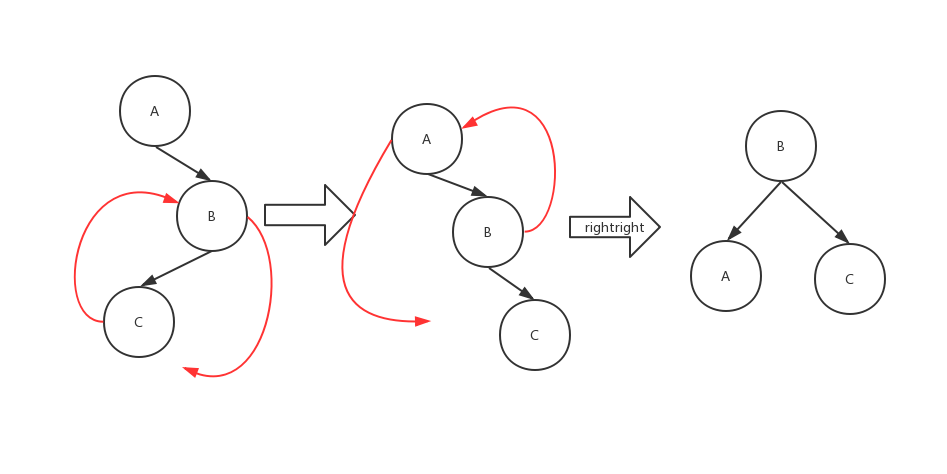

# AVL 树

AVL树，也称平衡二叉搜索树，AVL是其发明者姓名简写。AVL树属于树的一种，而且它也是一棵二叉搜索树，不同的是他通过一定机制能保证二叉搜索树的平衡，平衡的二叉搜索树的查询效率更高。

# AVL树特点

- AVL树是一棵二叉搜索树。
- AVL树的左右子节点也是AVL树。
- AVL树拥有二叉搜索树的所有基本特点。
- 每个节点的左右子节点的高度之差的绝对值最多为1，即平衡因子为范围为[-1,1]。

## 二叉搜索树的平衡

基础的二叉搜索树构建出来可能会存在不平衡的现象，比如极端情况下，按照A B C D E F G H顺序插入树中，结果为，

所以AVL树的出现就是为了解决平衡性问题，它的核心内容就是平衡处理机制，即所谓的旋转，一共有四种形式的旋转：右单旋、左单旋、左右双旋和右左双旋。

## 插入方式

AVL树一共有四种插入方式，根据插入方式不同需要做不同的旋转操作，现在往下看四种插入方式，设受插入节点影响而失去平衡的节点的父节点为Z，

### LL插入方式

对于left-left的插入方式，我们使用右旋转来达到平衡，以下面这个例子为例，将B节点向上提升，然后将A节点转化为B节点的右节点，这里需要注意，如果B之前有右子树的话，需要把他转化到A节点的左子树上

### RR插入方式

对于right-right的插入方式，我们使用左旋转来达到平衡，以下面这个例子为例，将B节点向上提升，然后将A节点转化为B节点的左节点，这里需要注意，如果B之前有左子树的话，需要把他转化到A节点的右子树上

### LR插入方式

对于left-right的插入方式，我们需要先将其转化为leftleft的插入方式，以下下面这个例子为例，将C节点上升，B节点转化为C节点的左节点，这时我们只需要再做一次left-left旋转即可

### RL插入方式

对于right-left的插入方式，我们需要先将其转化为right-right的插入方式，以下下面这个例子为例，将C节点上升，B节点转化为C节点的右节点，这时我们只需要再做一次right-right旋转即可

